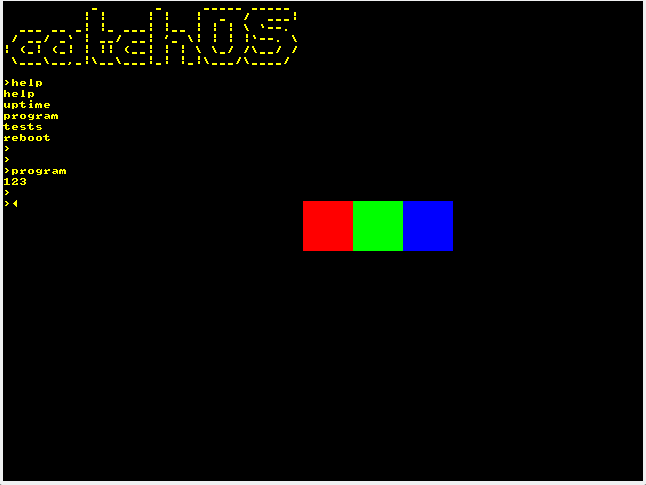

## catchOS
A unix-like monolithic kernel, plus some userland applications (non POSIX-compliant).



http://www.read.seas.harvard.edu/cs161/2018/pset5/

https://linux-kernel-labs.github.io

```
sudo apt install build-essential nasm genisoimage bochs bochs-sdl libsdl2-2.0 qemu-system-x86
git submodule update --init
```

```
./run.sh
```

Kernel's features:
- 32-bit protected memory
- Virtual memory
- Heap allocation
- Preemptive multi-tasking
- Userland programs that will probably run in ring 0

