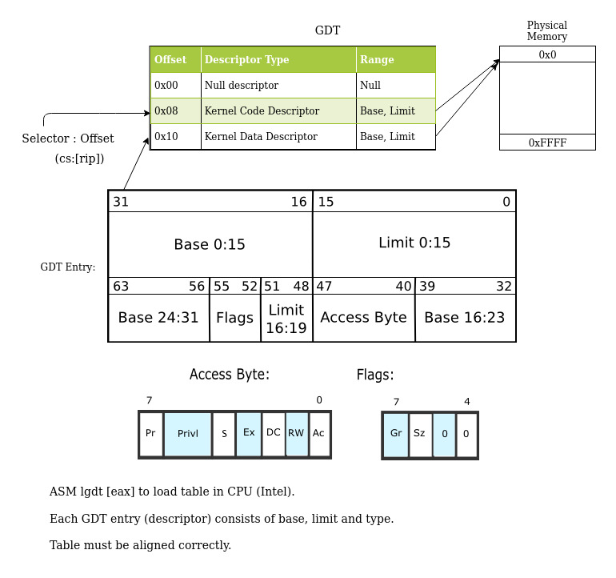
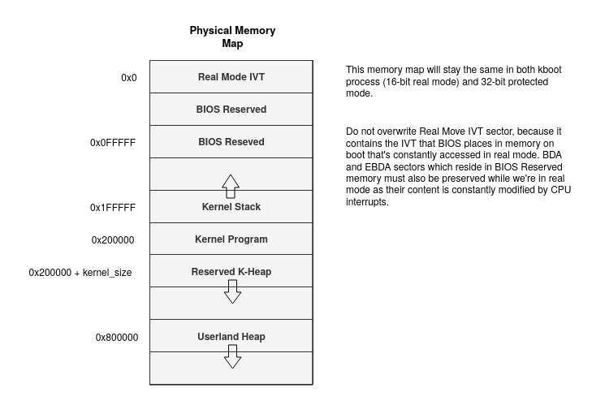
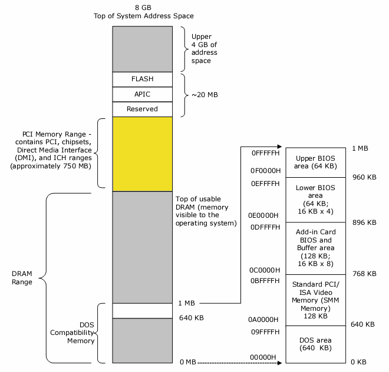
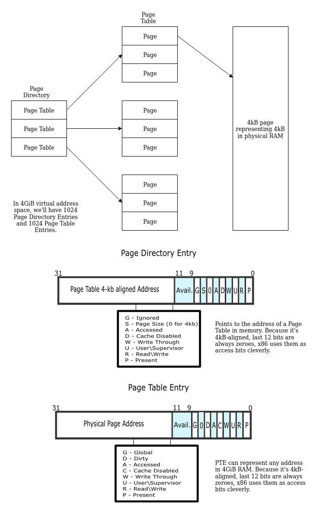
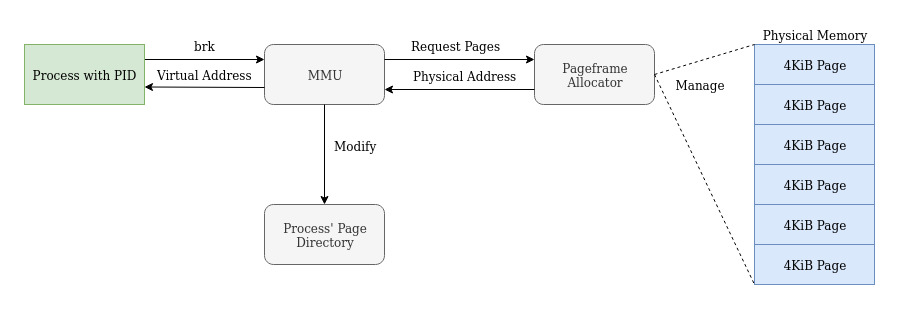
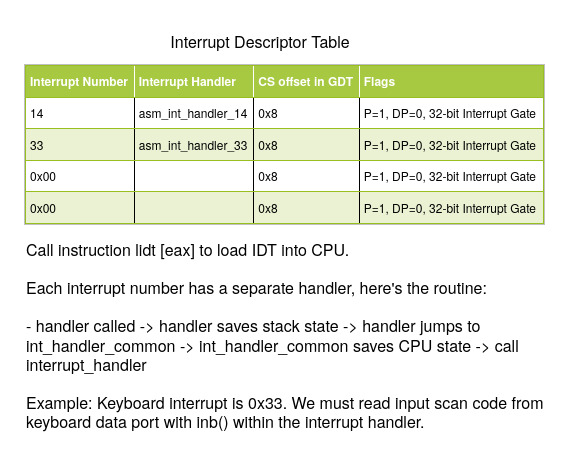
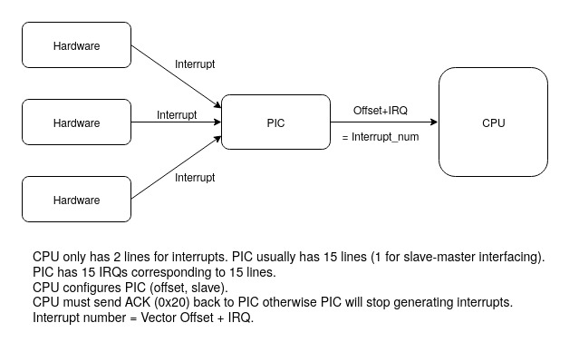
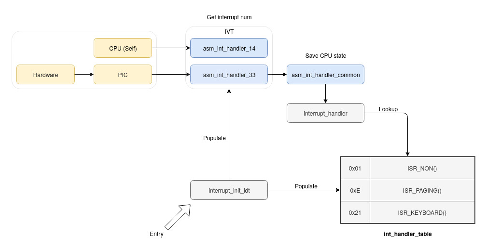
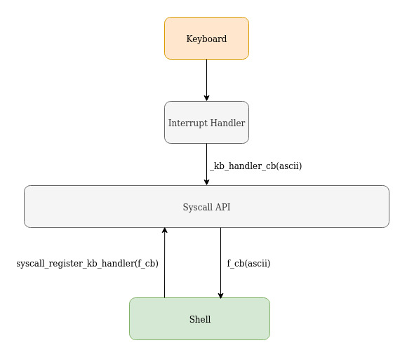
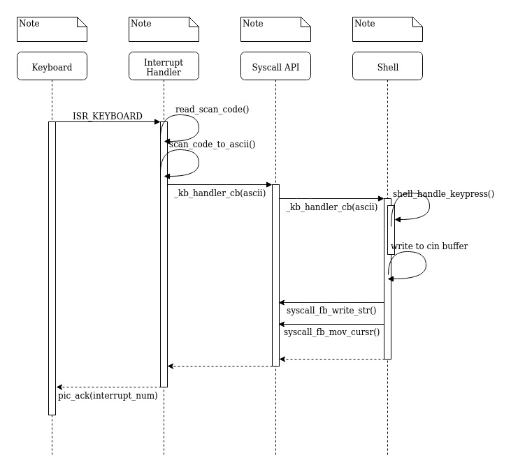

- [4. Kernel](#4-kernel)
  * [4.1 Memory](#41-memory)
    + [4.1.1 Detecting Memory's Limits](#411-detecting-memory-s-limits)
    + [4.1.2 Global Descriptor Table](#412-global-descriptor-table)
    + [4.1.3 Physical Memory Map](#413-physical-memory-map)
    + [4.1.4 Reserved Memory Space On x86](#414-reserved-memory-space-on-x86)
    + [4.1.5 Paging](#415-paging)
    + [4.1.6 Higher-Half Kernel](#416-higher-half-kernel)
    + [4.1.7 Memory Management Unit](#417-memory-management-unit)
  * [4.2 Interrupts](#42-interrupts)
    + [4.2.1 Interrupt Descriptor Table](#421-interrupt-descriptor-table)
    + [4.2.2 Programmable Interrupt Controller](#422-programmable-interrupt-controller)
    + [4.2.3 Interrupt Handler Implementation](#423-interrupt-handler-implementation)
    + [4.2.4 Hardware Interrupts](#424-hardware-interrupts)
      - [4.2.4.1 Keyboard](#4241-keyboard)
      - [4.2.4.2 Pagefault](#4242-pagefault)
      - [4.2.4.3 Programmable Interval Timer](#4243-programmable-interval-timer)
    + [4.2.5 Software Interrupts](#425-software-interrupts)
      - [4.2.5.1 Mode Switching](#4251-mode-switching)
      - [4.2.5.2 System Calls](#4252-system-calls)
  * [4.3 I/O](#43-i-o)
    + [4.3.1 stdin](#431-stdin)
    + [4.3.2 Video](#432-video)
  * [4.3 Multitasking](#43-multitasking)
    + [4.3.1 Context Switching](#431-context-switching)
    + [4.3.2 Scheduler](#432-scheduler)
    + [4.3.3 Multitasking API](#433-multitasking-api)
  * [4.4 System Calls](#44-system-calls)
  * [4.5 Clock Sources](#45-clock-sources)
    + [4.5.1 Programmable Interval Timer](#451-programmable-interval-timer)


## 4. Kernel

### 4.1 Memory
#### 4.1.1 Detecting Memory's Limits
- BIOS keeps a record of types of RAM.
- Thus BIOS can detect the type of RAM installed and its features.
- Because BIOS is in ROM, it can mess with RAM without consequences.
- So we ask BIOS for info on RAM.
- At the moment, we use multiboot info header to get memory upper and lower limits.
#### 4.1.2 Global Descriptor Table

#### 4.1.3 Physical Memory Map

#### 4.1.4 Reserved Memory Space On x86

#### 4.1.5 Paging

- With Paging enabled, when a memory address is deferenced, x86 goes to the Paging Directory
to look for the corresponding Page Table that manages 4MiB of the physical memory region.
- Once paging is enabled, everything must use paging, including the kernel (even interrupts).
- Page directory is stored in CR3 register, we change this register on each context switch so no 2 processes may 
share the same address space.

```
// Here 2nd Page Table is looked up (because each Page Table manages 4MiB), 
// then 4 bytes at offset 0x100000 in the Page Table is set to 0x2.
int *p = 0x500000;
*p = 0x2;
```
#### 4.1.6 Higher-Half Kernel
- Because a user program always assumes it owns all the memory. All compiled programs starts 
at 0x0 in virtual memory, so we should place the kernel somewhere else so they don't overlap.
- With a lot of linker and paging-on-boot hacking, we place the kernel at 0xc0000000 (3GiB).
- From now on, all absolute physical addresses must add 0xc0000000 to its address (e.g. the VGA 
buffer must be at 0xc00b8000 instead of 0x000b8000). Everything that requires physical address 
to work must also be translated before passed in as arguments(e.g. the Page Directory in paging_init).
- After we set up Higher-Half, all functions and variables referenced in our kernel code are located 
on higher half of virtual memory space. i.e. ISR_KEYBOARD routine is at 0xc0203d54.
- Future user programs may easily make system calls as the kernel is in their address space.

```
higher_half_init() -> kboot() -> kmain() -> paging_init()
```

#### 4.1.7 Memory Management Unit
Virtual Memory Layout of a user program


Pageframe Allocator

- We use a bitmap to keep track of which physical memory pages are available. 1 bit represents 1 page (4KiB).
- Allocating a new page will take O(n) time, modifying a page will take O(1) time.

Memory Allocator
- Manages chunks of requested memory. We can use external online libs here (e.g. K&R).
- Translates physical addresses into virtual addresses for processes.


### 4.2 Interrupts
#### 4.2.1 Interrupt Descriptor Table

- We use Interrupt Gates in our kernel because they disable interrupts before executing the handler code, as opposed to Trap Gates.
- Task Gates are for hardware context-switching, so we will not use them in our kernel at all.
#### 4.2.2 Programmable Interrupt Controller

- All hardware interrupts must go through the PIC (ATA, keyboard, etc.).
- All CPU-generated interrupts do not go through the PIC.
#### 4.2.3 Interrupt Handler Implementation

#### 4.2.4 Hardware Interrupts
##### 4.2.4.1 Keyboard
- When a key is pressed, the keyboard sends an interrupt to the PIC, which is then sent to the CPU.
The interrupt number is 0x1, plus the PIC offset (0x20 in our case) becomes 0x21.
- When we receive this interrupt, the ISR must read the scan code from the keyboard port, then translate
this scan code into ascii code.
- Both key presses and key releases generate interrupts. If we hold down a key, interrupts will keep 
getting triggered.

PS/2:
```
Key press-> keyboard controller recognizes press -> sends interrupt to CPU
```
vs USB:
```
Key press -> keyboard controller recognizes press -> stores keypress until USB poll -> sends status to USB controller -> USB controller sends interrupt to CPU
```

##### 4.2.4.2 Pagefault
- Interrupt number 14.
- This is an exception, which is a kind of interrupt.
- The CPU generates this to interrupt itself, thus pagefault interrupt will not go through the PIC.
- After paging is enabled, when an unmapped memory address is dereferenced, the CPU generates a pagefault interrupt.
- We should translate this into a segmentation fault signal.

##### 4.2.4.3 Programmable Interval Timer
- Interrupt number 32 (i.e. 0x20 + 0 for IRQ0).
- Is generated every interval, based on PIT configurations.

#### 4.2.5 Software Interrupts
- We can populate the IDT with custom interrupt numbers.
- In user mode we may call asm(int <num>) to execute the software interrupt.

##### 4.2.5.1 Mode Switching
- TODO: interrupt to switch from user mode to kernel mode privilege?

##### 4.2.5.2 System Calls
- Interrupt number 128.
- Userland applications will call ```int 128```, with syscall number in EAX to invoke a system call.


### 4.3 I/O
#### 4.3.1 stdin


How the shell uses syscall to handle keyboard input and screen output



Sequence diagram on what happens when a key is pressed

PS/2:
```
Key press-> keyboard controller recognizes press -> sends interrupt to CPU
```
vs USB:
```
Key press -> keyboard controller recognizes press -> stores keypress until USB poll -> sends status to USB controller -> USB controller sends interrupt to CPU
```

#### 4.3.2 Video

To display data on VGA monitors. We stick to the safest resolution for now which is 640x480x16.

We can change this resolution by modifying multiboot header asm file.

We use VESA BIOS Extension 3.0 standard. This gives us direct access to the linear framebuffer on compliant video cards. Multiboot2 will detect and expose this structure for us during boot.

We use hardcoded bitmap font for ASCII text.

The brush color is a global state. Call the function to set brush color if you want to change graphics or text color.

https://wiki.osdev.org/VESA_Video_Modes (Outdated).


### 4.3 Multitasking
- We use Preemptive Multitasking model with priority based round-robin scheduling algorithm.
- This means a timer will trigger an interrupt to run a scheduler, who picks the most appriopriate task to switch to. We use the PIT in our kernel.

#### 4.3.1 Context Switching
- Transition between tasks, the content of EIP, SS, general registers of each thread are saved and restored accordingly.
- A task may switch to any other task except the scheduler at any given time.
- A task may create many child tasks.
- We return from context switching with "ret" instruction, while the address of next task's eip on top of the stack. See info on ret: https://docs.oracle.com/cd/E19455-01/806-3773/instructionset-67/index.html
- On task return, it'll return to a global clean up function on_current_task_return_cb(). This function will clean up resources based on the task's state. On task_new(), this function is placed second from stack top, behind argument pointer. It acts as a return address.
- Context switching is not related to mode switching (aka transitioning between user mode and kernel mode or vice-versa).

#### 4.3.2 Scheduler
- Priority based round-robin algorithm.
- All tasks are shared a time slice based on their priority. For example, a task with priority 8 and a task with priority 2 are running at the same time. The task with priority 8 with get 80% of cpu time.

#### 4.3.3 Multitasking API
See "tasks.h" file for details on ```struct task_struct```.
```
struct task_struct* task_new(void (*fp)(void*), void* arg, unsigned int stack_size, int priority)
```
- Create a new task and register it with the scheduler. The new task will run immediately if global interrupt is enabled i.e. the scheduler is running.
- The stack of the newly created task is as follow:
```
- Task's stack map -
[arg]
[address of on_current_task_return_cb()]
[next eip]
[reg]
[reg]
[reg]
[reg]
[reg]
[reg]
[reg]
[EFLAGS reg] <- esp
```

```
void task_join(struct task_struct*)
```
- Wait in current task until specified task returns. Blocking.

```
void task_detach(struct task_struct*)
```
- Detach specified task, then keep executing the next instructions.
- When detached task reaches return, it'll be cleaned up automatically by global clean up function.

```
void task_yield()
```
- Manually give up control to the scheduler.


### 4.4 System Calls
- User applications may call kernel by executing interrupt 0x80: ```int 80h```.
- The number in EAX register at the moment of interrupt is the syscall number.


| Syscall |           Description          |             Arguments            |           Return Values          |
|:-------:|:------------------------------:|:--------------------------------:|:--------------------------------:|
|   0x2   | mmap. Request heap allocation. | ECX: Number of bytes             | EAX: Address of allocated memory |
|   0x3   | munmap. Free allocated memory. | ECX: Address of allocated memory |                                  |
|         |                                |                                  |                                  |

https://www.tablesgenerator.com/markdown_tables


### 4.5 Clock Sources
#### 4.5.1 Programmable Interval Timer
- Input signal is an oscillating crystal. [1193182hz Crystal] -> [PIT] -> [PIC] -> [CPU].
- Has 3 channels, channel 0 is connected to line IRQ0 of the PIC. We only use this channel.
- IRQ0 is generated every clock pulse.
- Frequency of output clock signal can be configured by writing divisor value to channel0 port. Freq(Hz) = 1193182 / divisor.
- Divisor is a 16 bit uint.
- Send the divider as low byte then high byte.
- Use a square wave.
- Use binary mode.

```
I/O port     Usage
0x40         Channel 0 data port (read/write)
0x41         Channel 1 data port (read/write)
0x42         Channel 2 data port (read/write)
0x43         Mode/Command register (write only, a read is ignored)
```

https://wiki.osdev.org/Programmable_Interval_Timer

